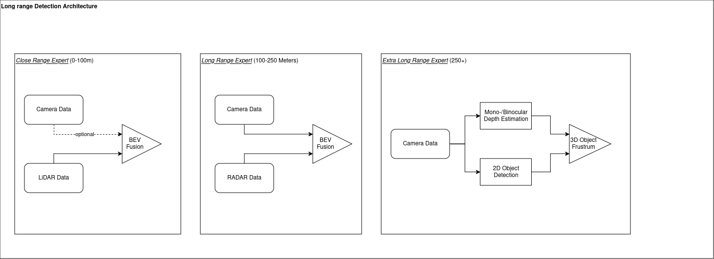

# Multimodal Range of Experts Model for Long-Range Object Detection

Multimodal Range of experts for 3D detection, one model specializing at near to mid-range objects, and one at long-range 3D detection potentially with overlapping obejcts detected.

## Methodology

The key idea of the proposed model is to combine and fuse different sensor data for detection of objects at various distances. Based on the facts, that
- ... LiDAR pointclouds are dense for nearby objects, but the density decreases rapidly with increasing distance
- ... RADAR pointclouds are sparse but have are still available for larger distances (up to 400m) and provide velocity information, which is more important for far away objects
- ... Camera images provide an optimal detection framework for any type of object (under sufficient illumination conditions) but lack spatial information

the idea of the proposed method is to leverage the strenght of each sensor type for detection of objects. We divide the region of interest in front of the vehicle into three segments:

- _Close Range Detection_: Fuse LiDAR and Camera data for detection of nearby objects (<100m)
- _Long Range Detection_: Fuse RADAR and Camera data for detection of nearby objects (100-250m)
- _Extra Long Range Detection_: Estimate depth from camera data and estimate distance of detected 2d objects using 3d frustrums (>250m)

We propose to loosen the requirement for accurate detection with increasing distance from the ego vehicle and argue, that for long range detection the IoU (Intersection over Union) metric poses an ill choice. Since arguably, the *presence* of a vehicle and its approximate location in [Fernet](https://github.com/fjp/frenet) coordinates with respect to lane information along with directional velocity (towards/away from ego) is more important than an accurate bounding box of a vehicle we propose to replace the commonly used IoU as a n metric for model evaluation and use dimension dempendent weighing in nthe loss functino, that applies different weights to scale, label, position and orientation of the bounding box. With our approach, the model should be inclined, to accurately predict true positive instances with increased invariance to position, scaler, orientation and label of the object.        




## Getting started

To make it easy for you to get started, using a conda environment will be the easy way. 

## Installating Dependencies

Execute in `mmdetection3d` directory:

```
conda create --name {ENV_NAME} python=3.10 -y
conda activate {ENV_NAME}
conda install pytorch==1.13.1 torchvision==0.14.1 torchaudio==0.13.1 -c pytorch
pip install -U openmim
mim install mmengine
mim install 'mmcv==2.0.0rc4'
mim install 'mmdet==3.0.0'
pip install -r requirements.txt
pip install nuscenes-devkit/setup
```

**Make sure that the CUDA version is 11.8+**

Experiments are based on BEVFusion as the base model, `cd mmdetection3d/projects/BEVFusion` and follow the instructions for compiling operations on CUDA. MMDetection3D workflow is based on config files. In order to train the model for long range detection the following config files are used see `mmdetection3d/projects/BEVFusion/configs`

## Training

To train a lidar-only detector at range until 100m, use the following config

``` 
python tools/train.py projects/BEVFusion/configs/bevfusion_lidar_100m_voxel0075_second_secfpn_8xb4-cyclic-20e_nus-3d.py 

```

## Datasets

### Nuscenes

Download the Nuscenes dataset and mount the dataset folder to `mmdetection3d/data/nuscenes`

Check [this](https://gitlab.dai-labor.de/beintelligent/tp3/range_of_experts/-/blob/main/mmdetection3d/docs/en/advanced_guides/datasets/nuscenes.md) for setting up the dataset in-order to train a model configuration.

### Argoverse AV2 Sensor Dataset 

TBD

### BeIntelli 

TBD

## TODOs : 

- [ ] Migrate Radar Backbone code from BEVFusion
- [ ] Check Camera sampling angles when fusing with LiDAR and RADAR respectively
- [ ] Check Distance filter and voxel grid params


## Ablation Studies

#### BEVFusion Nuscenes (0m-150m)
  

| Modality | Voxel type (voxel size) | NDS | mAP| config | 
| ------ | ------ | ------ | ------ | ------ |
|   L     |    voxel (0.075)    |  0.670 | 0.680 | [config](https://gitlab.dai-labor.de/beintelligent/tp3/range_of_experts/-/blob/main/mmdetection3d/projects/BEVFusion/configs/bevfusion_lidar_150m_voxel0075_second_secfpn_8xb4-cyclic-20e_nus-3d.py?ref_type=heads) |
|   C+L     |  voxel (0.075)    |  0.670 | 0.623 | [config](https://gitlab.dai-labor.de/beintelligent/tp3/range_of_experts/-/blob/main/mmdetection3d/projects/BEVFusion/configs/bevfusion_lidar-cam_150m_voxel0075_second_secfpn_8xb4-cyclic-20e_nus-3d.py?ref_type=heads) |

